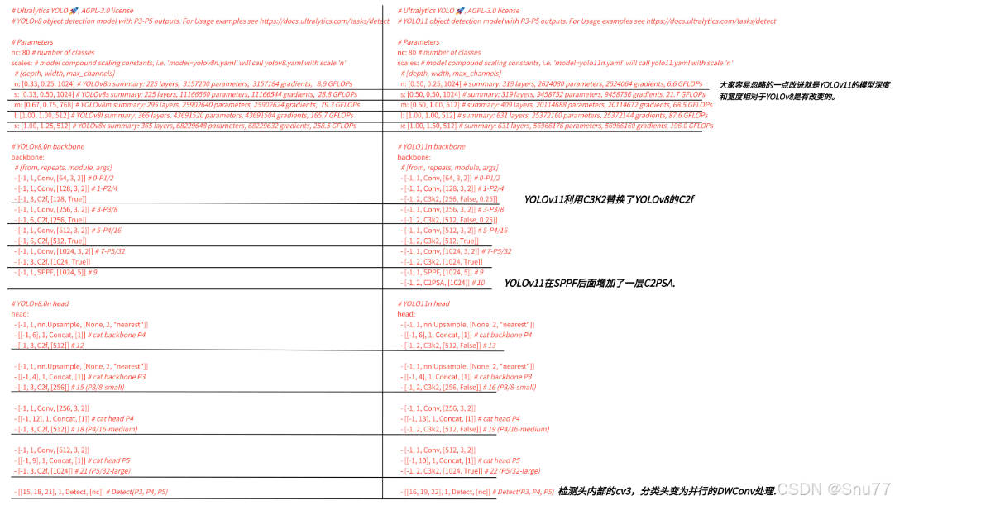
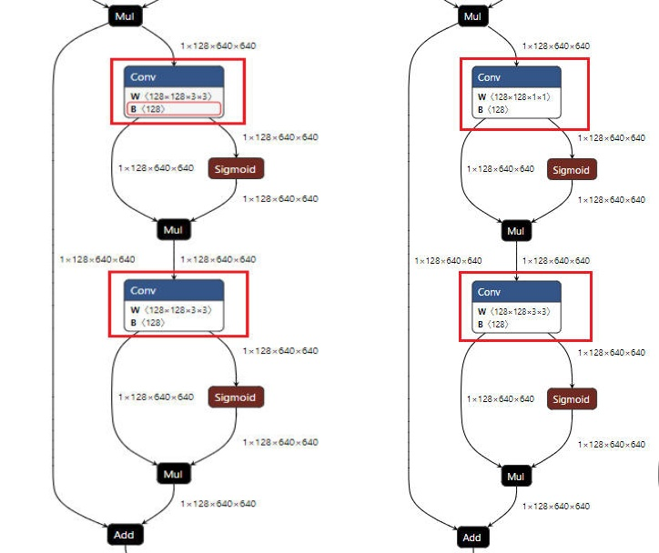
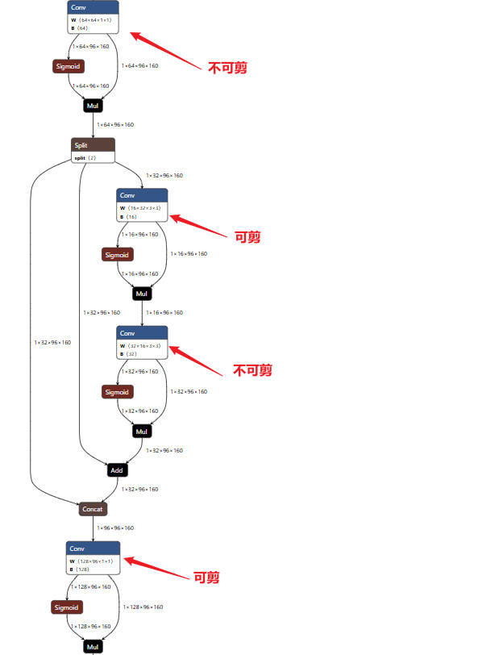
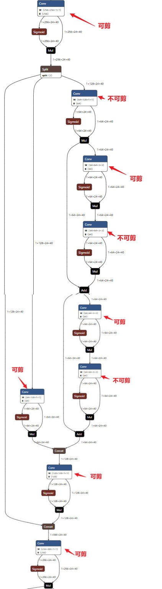
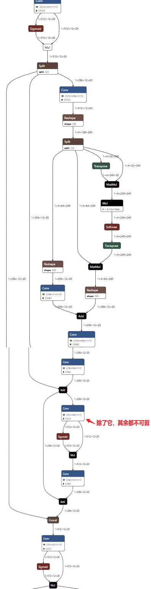
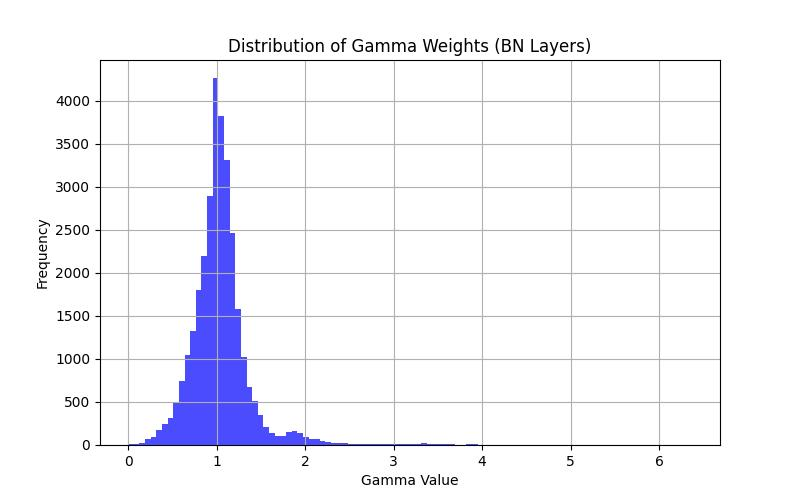
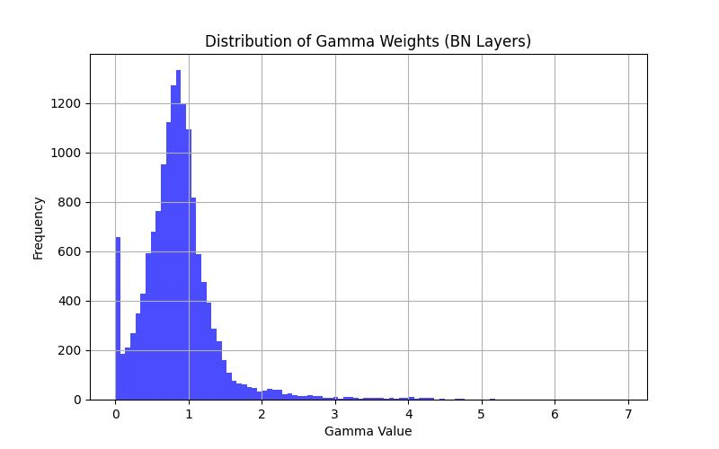

<h1 align="center">YOLOv11-Prune</h1>

**NOTE:  原创内容, 引用请注明出处。对基于BN层加L1正则稀疏化剪枝不熟悉的可以先看我的上一篇yolov8-prune原理部分**

## 一. 模型结构的区别
[reference](https://blog.csdn.net/java1314777/article/details/142665078)

Bottleneck、C3、C2f模块与原来相同

C3k是C3的变体, 与C3的区别: 

C3模块的BottleNeck分支中的卷积核大小第一次是1x1, 第二次是3x3; 而在C3k中两次卷积的卷积核大小都是3x3

C2f与C3的区别:

C3模块的BottleNeck分支中的卷积核大小第一次是1x1, 第二次是3x3; 而C2f中两次卷积的卷积核大小都是3x3

C3模块是将同一份输入同时走两个分支, 结果再进行concat; 而C2f是将输入沿着通道进行split, 同时走两个分支结果再进行concat

C3k2是C2f模块的变体, 与C2f的区别:

C2f模块的子分支是BottleNeck分支, 而C3k2模块的子分支可以是BottleNeck分支, 也可以是C3k

## 二. 不可剪枝部分

### 1. C3k2中的残差结构(C3k等于False时)

### 2. C3k2中的残差结构(C3k等于True时)

### 3. PSABlock中的大部分结构

### 4. Detect中的最后一个卷积以及深度可分离卷积DWConv

## 三. 使用方法

下载本仓库的代码, 在本仓库中除了ultralytics的官方代码, 还包含train.py、train_sparsity.py、prune.py、finetune.py、val.py

这里在某个单类别检测数据集上实验(其他数据集同理)。

### 1. 首先使用train-normal.py进行正常训练:

需要下载好权重文件放在train-normal.py同级目录的weights文件夹下;

配置好datasets的yaml文件,  配置方式参考ultralytics官方代码: ultralytics/cfg/datasets/coco128.yaml;

指定训练代数, 制定sr=0(L1正则项惩罚系数为0)

### 2. 然后使用train_sparsity.py稀疏训练：

这里要指定sr的值, 因为要进行稀疏训练, 所以惩罚项一定要有值; 该值越大, 惩罚力度越大, BN层的gamma值的稀疏度就越高

### 3. 使用vis-bn-weight.py可以查看一下, 稀疏前后bn层gamma值的分布变化, 可以明显看到等于0的gamma值在变多

### 4. 训练完成后使用prune.py进行剪枝, 代码详见prune.py:

这里--data、--weights改成自己的,  --cfg不要变, --model-size要保持和前面训练的模型一致(前面是yolov11s, 这里也要指定为s), --prune-ratio为剪枝比率, --save-dir为剪枝后的模型存储的目录

剪枝以后产生的权重文件名为prune.pt

### 5. 使用finetune.py进行微调：

这里设置好微调的轮数, 一定要制定finetune=True

微调产生的模型文件在runs文件夹下

### 6. 使用val.py进行验证, 使用export.py导出为onnx......

## 四. 注意事项
稀疏训练时需禁用amp, 禁用scaler, 禁用grad_clip
想要看到所有针对源码的更改代码, 在该工程下全局搜索'===========', 所有的代码改动前后均使用'==========='包覆
简单的任务可剪较大比率不影响效果，复杂任务可剪比率很小，且可能会掉点严重，掌握原理才能心中有数。

## TODO
多卡DDP模式下, 稀疏训练无法产生稀疏效果

