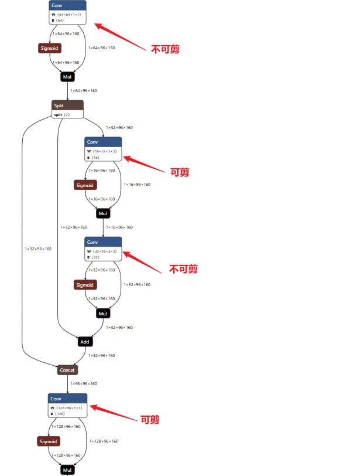
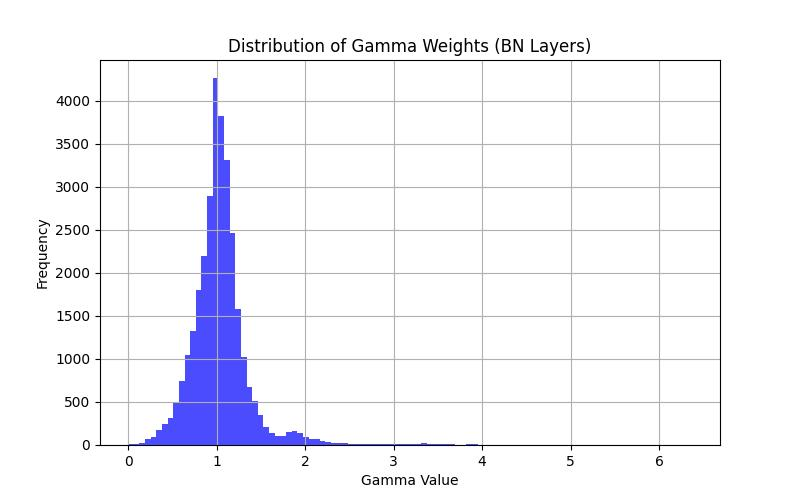

<h1 align="center">YOLOv11-Prune</h1>

> **Note**: **Original Content. Please credit the source when referencing.**
>
> If you are not familiar with L1 regularization pruning based on Batch Normalization (BN) layers, please refer to my previous explanation in the [YOLOv8-Prune](https://github.com/JasonSloan/yolov8-prune) section.

------

## **1. Differences in Model Architecture**

[reference](https://blog.csdn.net/java1314777/article/details/142665078)


### **Key Components**:

- **Bottleneck, C3, C2f**: These modules remain the same as in the original YOLO architecture.

- **C3k**: A variant of the C3 module.

  - **Difference from C3**:
    In the C3 module, the bottleneck branch uses a convolution kernel size of **1x1** for the first layer and **3x3** for the second layer.
    In **C3k**, both layers use a convolution kernel size of **3x3**.

    

- **C2f**:

  - Difference from C3

    :

    - The bottleneck branch in the C3 module uses a kernel size of **1x1** for the first layer and **3x3** for the second layer. In **C2f**, both layers use a kernel size of **3x3**.
    - The **C3 module** processes the same input through two branches and concatenates the results, while **C2f** splits the input channels into two parts, processes them through two branches, and concatenates the results.

- **C3k2**: A variant of the **C2f** module.

  - Difference from C2f

    :

    - In **C2f**, the sub-branch is a bottleneck.
    - In **C3k2**, the sub-branch can be either a bottleneck or a **C3k** module.

------

## **2. Non-Prunable Parts**

1. **Residual Structure in C3k2** (when `C3k=False`).

   

2. **Residual Structure in C3k2** (when `C3k=True`).

   

3. **Most Structures in PSABlock**.

   

4. The **last convolution layer** and **depthwise separable convolution (DWConv)** in the Detect head.

------

## **3. Usage**

This repository includes not only the official **Ultralytics YOLOv8 code**, but also additional scripts such as:

- `train.py`
- `train_sparsity.py`
- `prune.py`
- `finetune.py`
- `val.py`

Below are the steps for pruning on a single-class detection dataset (similar steps apply to other datasets).

------

### **Step 1: Normal Training**

Use `train-normal.py` for standard training:

- Place the pre-trained weights in the `weights` folder (at the same level as `train-normal.py`).
- Configure the dataset `.yaml` file. Follow the format in the official YOLOv8 repo (e.g., `ultralytics/cfg/datasets/coco128.yaml`).
- Specify the number of training epochs and set `sr=0` (disable L1 regularization).

```
python train-normal.py --data <your-dataset.yaml> --weights <path-to-weights> --epochs <num-epochs> --sr 0
```

------

### **Step 2: Sparse Training**

Use `train_sparsity.py` for sparse training:

- Specify the `sr` value (L1 regularization penalty term).
- Larger `sr` values result in higher sparsity (more BN gamma values driven to zero).

```
python train_sparsity.py --data <your-dataset.yaml> --weights <path-to-weights> --sr <regularization-value>
```

------

### **Step 3: Visualize BN Gamma Distribution**

Use `vis-bn-weight.py` to visualize the distribution of BN gamma values before and after sparse training. This will show the increase in zero-valued gamma entries.

```
python vis-bn-weight.py --weights <path-to-weights>
```

------




### **Step 4: Pruning**

Use `prune.py` for pruning.

- Adjust `--data` and `--weights` to your specific files.
- Keep `--cfg` unchanged.
- Ensure the `--model-size` matches the previous training size (e.g., `s` for YOLOv11s).
- Set `--prune-ratio` to the desired pruning ratio.
- Set `--save-dir` to the directory where pruned models will be saved.

```
python prune.py --data <your-dataset.yaml> --weights <path-to-weights> --cfg <cfg-path> --model-size s --prune-ratio <ratio> --save-dir <output-dir>
```

This generates a pruned weights file named `prune.pt`.

------

### **Step 5: Fine-Tuning**

Use `finetune.py` to fine-tune the pruned model:

- Specify the number of fine-tuning epochs.
- Set `finetune=True`.

```
python finetune.py --weights prune.pt --finetune True --epochs <num-epochs>
```

The fine-tuned model will be saved in the `runs` folder.

------

### **Step 6: Validation and Export**

- Use `val.py` to validate the fine-tuned model.
- Use `export.py` to convert the model to **ONNX** format for deployment.

------

## **4. Notes**

1. During sparse training, disable:
   - Automatic mixed precision (`amp`).
   - Gradient scaler.
   - Gradient clipping.
2. To view all source code modifications, globally search for `===========` within the project. All changes are wrapped with `===========` for clarity.
3. **Tips for Pruning Ratios**:
   - For simple tasks, higher pruning ratios are feasible without significant performance loss.
   - For complex tasks, lower pruning ratios are recommended to minimize performance degradation.

Understanding the pruning principles is crucial for making informed decisions.

------

## **TODO**

- Sparse training currently does not achieve the desired sparsity under multi-GPU **DDP (Distributed Data Parallel)** mode.